# Scroogebank Enterprise CRM (CRUMBS)
[](#)
[](#)
[](#)
[](#)
[](#)
[](#)
[](#)
[](#)
[](#)
[](#)
[](#)
[](#)
[](#)
[](#)
[](#)
[](#)
[](#)
[](#)
[](#)
[](#)
[](#)
[](#)
[](#)
[](#)
[](#)
[](#)

A **cloud-native enterprise CRM platform** built for Scrooge Global Bank as the flagship project for **SMU CS301** (IT Solution Architecture) in collaboration with **UBS Singapore**.

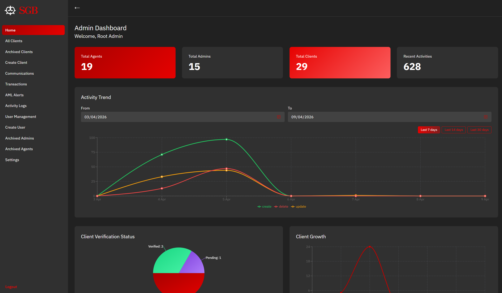


This system supports secure banking operations across user administration, client onboarding, account management, transaction workflows, auditability, and verification pipelines.

**Check out our project demo video below!**
[](https://www.youtube.com/watch?v=rY69Sh_sGok)
*https://www.youtube.com/watch?v=rY69Sh_sGok*


## 🏆 Key Technical Achievements
- **Performance:** Load-tested at **100 concurrent users** with target gates of **P95 < 5s** and **<1% error rate**, plus **200-thread stress** scenarios.
- **Availability:** Built for failover with **RDS Multi-AZ**, **2 AZs**, **4 subnets**, and **2 NAT gateways** in production architecture.
- **Security & Operations:** Enforced enterprise controls with **Cognito auth + MFA modes** and **GuardDuty**.
- **Observability:** Production telemetry is codified in Terraform with **35 CloudWatch alarms**, centralized **CloudTrail** auditing, and **SNS-backed alert routing** for faster incident detection.
- **Scalability:** Delivered a production-size cloud platform with **337 Terraform-managed resources**, including **3 ECS services**, **6 Lambdas**, and **21 API routes**.
- **Meaningful DevOps at-scale:** End-to-end automation via **CI/CD Pipelines** on **GitHub Actions** and **IaC** with **Terraform**.
- **Engineering Rigour:** Implemented CI-equivalent, multi-layer quality gates (lint, unit, integration, E2E, performance) and integrated security across the quality gates, API contracts, and infrastructure checks.

# 🏗️ System Architecture

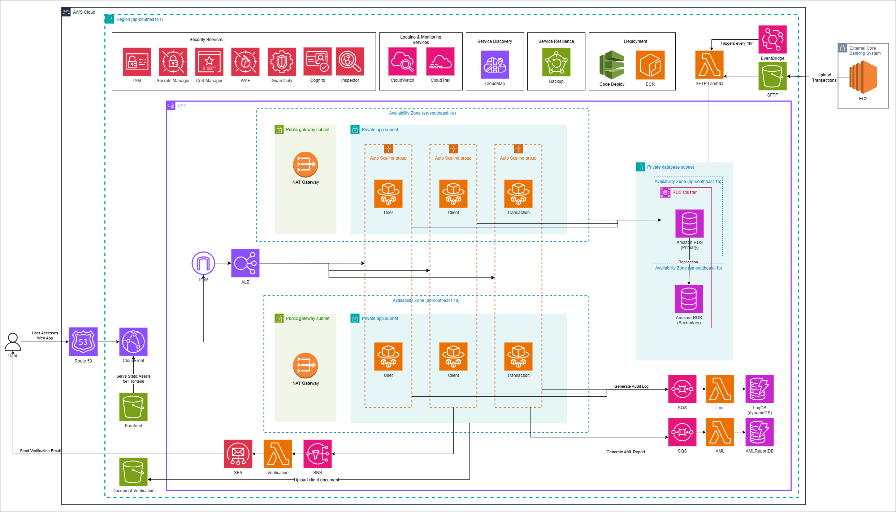

## ⚙️ Core Capabilities

- **Authentication and Access Control:** local/hybrid/Cognito modes, role-based access (RBAC), root-admin protections.
- **User Management:** create/manage admin and agent users with policy-aligned controls.
- **Client Lifecycle:** onboarding, KYC verification, account operations, archival/reinstatement flows.
- **Transactions and Compliance:** transaction retrieval/import workflows, audit logging, and AML alert pipelines.
- **Cloud Operations:** Terraform-based provisioning, environment profiles, local AWS emulation, and deployment scripts.

## 📱 User Interface Preview
### Login
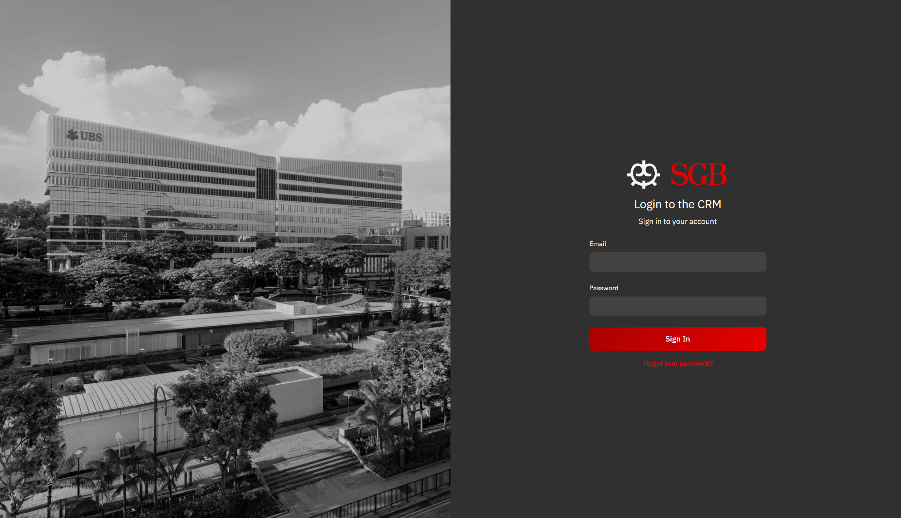

### Dashboard & Administration

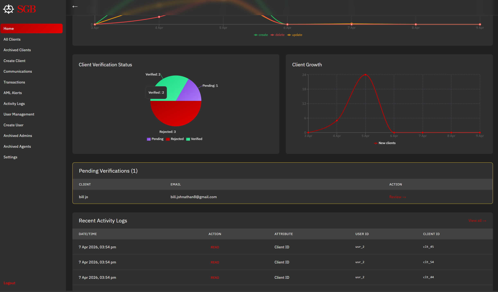

### User Management
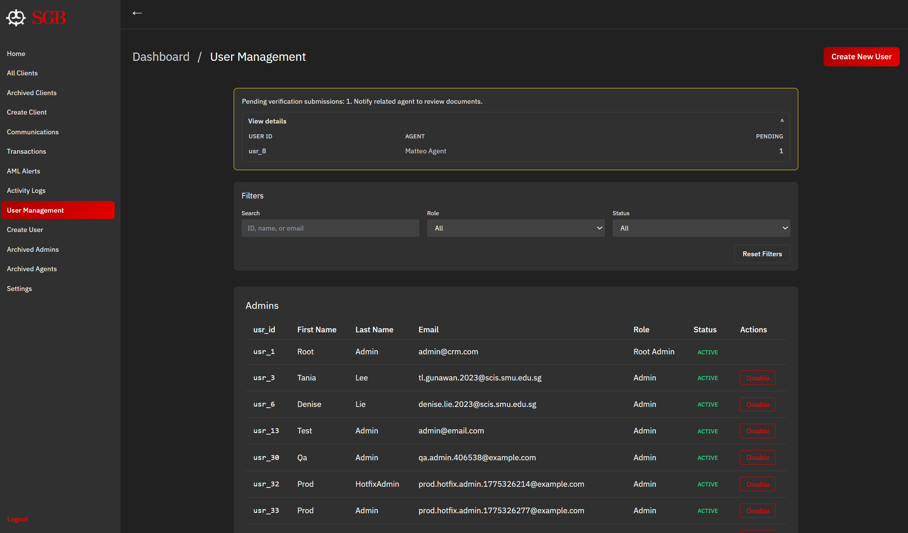

### Client Lifecycle
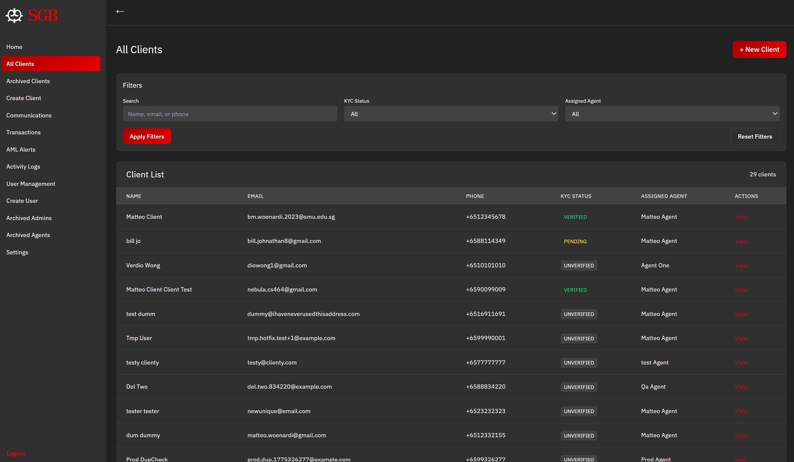
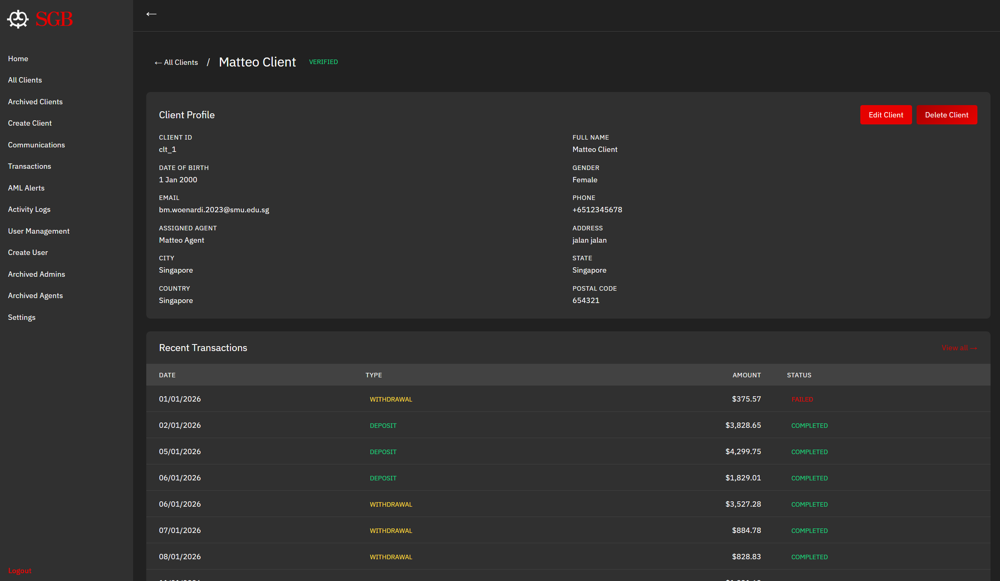
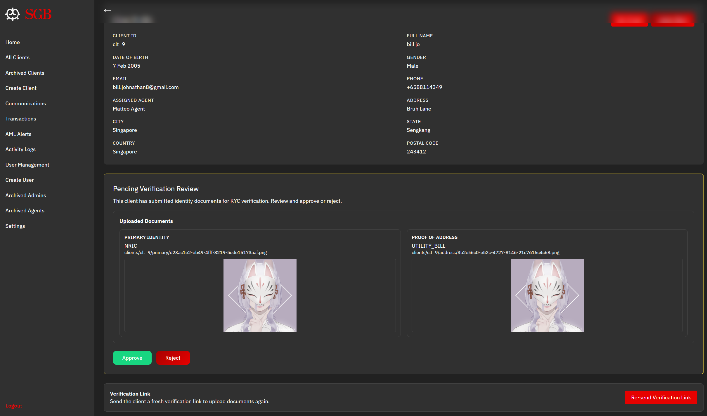
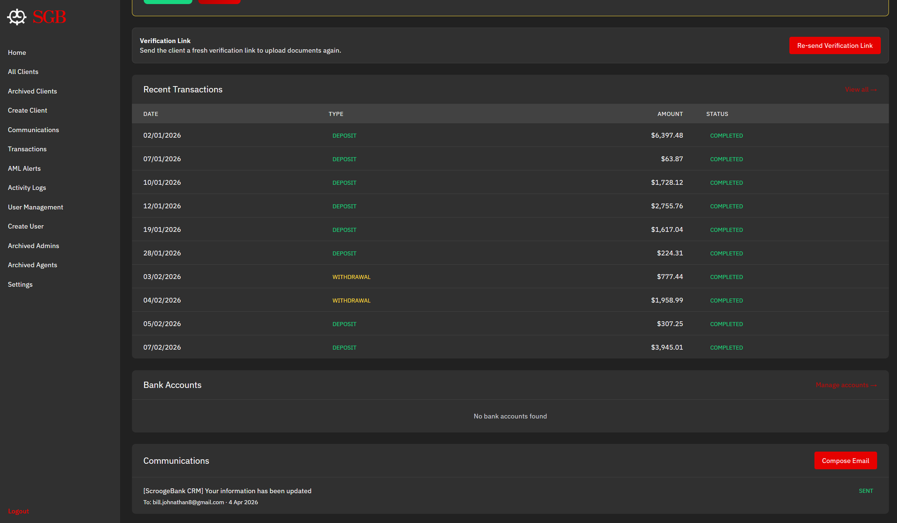

### Transactions & Monitoring
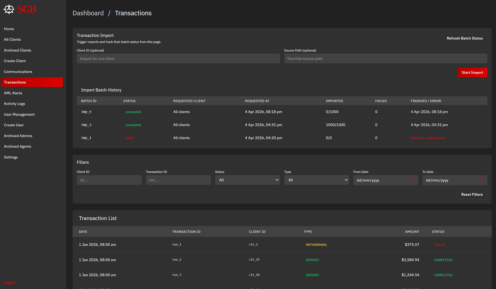
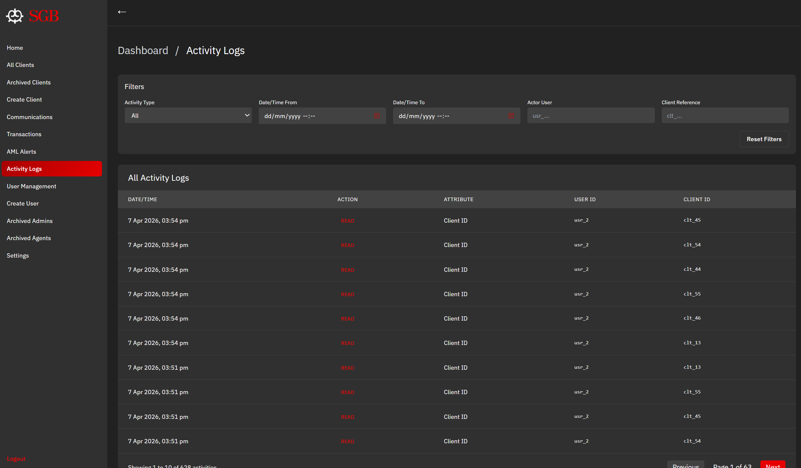

### Compliance & Alerts
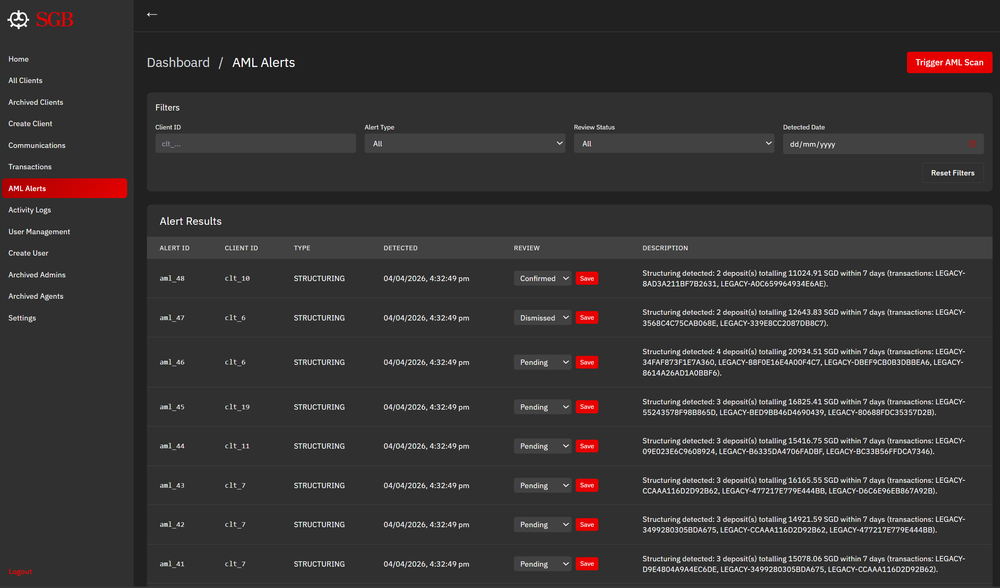

# 🧭 Getting Started

## 🧩 1. Prerequisites

- Git
- Docker Desktop (or Docker Engine)
- Java 21
- Node.js 22+
- Python 3.12+

Optional for cloud deployment workflows:
- Terraform
- AWS CLI
- `jq`

## 🛠️ 2. Configure Local Environment

```bash
cp .env.example .env.local
```

Set required values in `.env.local`:
- `LOCAL_DB_PASSWORD`
- `JWT_HMAC_SECRET`
- `E2E_ADMIN_PASSWORD`
- `E2E_USER_PASSWORD`

## ▶️ 3. Bootstrap tools and start the local stack

```bash
python scripts/pipelines/setup_dev_env.py
bash scripts/dev/stack-up.sh
```

## ✅ 4. Verify the app is running

- App gateway: `http://127.0.0.1:18088`
- Health checks:
  - `http://127.0.0.1:18088/api/user/health`
  - `http://127.0.0.1:18088/api/clients/health`
  - `http://127.0.0.1:18088/api/transactions/health`

Default seeded users:
- `admin@crm.com`
- `agent1@crm.com`

## 🧪 5. Run the main local test pipeline

```bash
python scripts/pipelines/test_all.py
```

## 🛑 6. Stop local services

```bash
bash scripts/dev/stack-down.sh
```

# 📚 Core Documentation

## 📍 Start Here!

- [Documentation hub](docs/README.md)
- [Tech stack](docs/infrastructure/tech-stack.md)
- [Database and environment configuration](docs/database_configuration.md)
- [Testing guide](docs/testing/TESTING-GUIDE.md)

## 🖥️ Frontend Documentation

- [Frontend guide](docs/frontend/README.md)
- [Core user flows](docs/frontend/core-user-flows.md)
- [Component hierarchy](docs/frontend/component-hierarchy.md)
- [Frontend service README](services/frontend/crm-ui/README.md)

## ☁️ Infrastructure and Deployment

- [LocalStack setup](docs/infrastructure/localstack-setup.md)
- [Terraform infrastructure workflow](docs/infrastructure/terraform-infra-workflow.md)
- [Terraform remote state setup](docs/infrastructure/terraform-remote-state.md)
- [Cognito auth rollout and modes](docs/infrastructure/cognito-auth.md)
- [SFTP ingestion setup](docs/infrastructure/sftp-setup.md)
- [InfraMap and Terraform graph tooling](docs/infrastructure/inframap-setup.md)

## 📐 Architecture Decisions and Contracts

- [ADR index](docs/architectural-decisions-record/README.md)
- [CAP theorem tradeoff ADR](docs/architectural-decisions-record/adr-0008-cap-tradeoff-analysis.md)
- [Role and root-admin contract](docs/api-contracts/role-root-admin-contract.md)
- [SFTP transaction ingestion contract](docs/api-contracts/sftp-transaction-ingestion-contract.md)
- [Audit/AML consumer event contracts](docs/api-contracts/audit-aml-consumer-event-contracts.md)
- [OpenAPI contracts](docs/api-contracts/openapi)

## 📊 Evidence and Operational Artifacts

- [AWS infrastructure map](docs/artifacts/aws-infrastructure-map.md)
- [Terraform inventory reconciliation](docs/artifacts/terraform-inventory.md)
- [Infrastructure cost estimate](docs/artifacts/cost-estimate.md)
- [Latest local CI-equivalent run summary](build-logs/test-all/last-run-summary.md)
- [Integration test docs](tests/integration/README.md)
- [Performance test docs](tests/performance/README.md)

## 🧰 Engineering Standards

- [Coding standards](docs/coding-standards/coding-standards.md)
- [Contributing guide (artifact)](docs/artifacts/CONTRIBUTING.md)
- [Final submission guide](docs/final-submission/README.md)

# 🍪 Team CRUMBS
**SMU CS301 G2-T3 (AY25/26 T2):**
> we ate and left no crumbs
- [Bill Johnathan](https://github.com/billjohnathan8) (Mr. CI)
- [Bernardinus Matteo Woenardi](https://github.com/mattw23n) (Mr. CD)
- [Denise Lie](https://github.com/deniseLie)
- [Peh Siew Yu](https://github.com/siewyu)
- [Tania Lee Gunawan](https://github.com/tanialee21)
- [Toh De Xue](https://github.com/dexue67)
- [Verdio Wong](https://github.com/verdiowong)

---

This project was completed as part of CS301 IT Systems Architecture at Singapore Management University. It demonstrates enterprise architecture design, cloud engineering, and software delivery practices in one integrated system.
