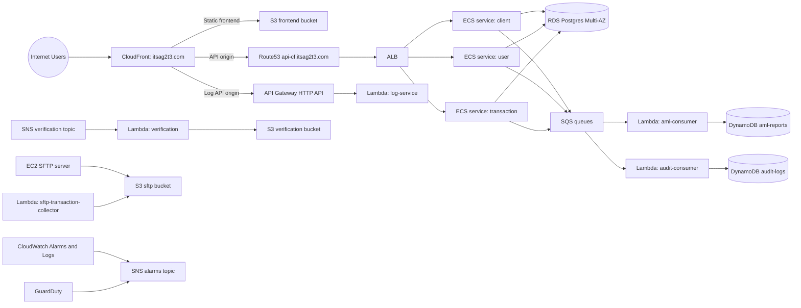

# AWS Infrastructure Map (Production)

Generated: 2026-04-05
Account: 699089610166
Primary region: ap-southeast-1
Edge/certificate region: us-east-1 (CloudFront ACM)

## 1) High-level architecture

## 2) Production resource map by layer

### Edge and ingress

- CloudFront distribution: `E339YUQCFN3WG`
- Public alias: `itsag2t3.com`
- Origins:
  - Frontend S3 origin
  - Backend ALB origin (`api-cf.itsag2t3.com`)
  - API Gateway origin (`67qfsiig88.execute-api.ap-southeast-1.amazonaws.com`)
- Route53 hosted zone: `itsag2t3.com`

### Network and transport

- VPC: `10.42.0.0/16`
- Subnets: 4 across two AZs
- NAT gateways: 2
- Internet gateway: 1
- Security groups include separate groups for ALB, ECS, Lambda, RDS, and SFTP EC2.

### Application compute

- ECS cluster: 1
- ECS services: 3 (`user`, `client`, `transaction`), each desired/running = 1
- Lambda functions: 6 (`log-service`, `aml`, `aml-consumer`, `audit-consumer`, `verification`, `sftp-transaction-collector`)
- API Gateway HTTP API: 1 (`scroogebank-crm-prod-log-http-api`) with 21 routes

### Data and storage

- RDS PostgreSQL: `scroogebank-crm-prod-postgres`, class `db.t4g.small`, Multi-AZ true
- DynamoDB: lock table + AML/audit application tables
- S3 buckets: backend, frontend, sftp, verification, tfstate, cloudtrail

### Messaging and async processing

- SQS queues: AML queue/DLQ and audit queue/DLQ
- SNS topics: alarms and verification
- Event-driven pipeline from SQS to consumer lambdas is active.

### Security and observability

- Cognito user pool is active for identity workflows.
- GuardDuty detector is enabled with core data sources (CloudTrail, DNS, VPC Flow Logs, S3 data events).
- CloudWatch alarms: 35 configured across ALB/ECS/RDS/SES and related services.
- CloudTrail bucket and trail are present.

## 3) Terraform-vs-live map reconciliation notes

- The major architecture in AWS matches the Terraform-defined platform shape.
- Drift was detected in deploy-mutable resources (ECS task definitions, Lambda versions) and SNS policy documents.
- One SFTP security-group ingress rule managed by Terraform appears deleted in live state and should be explicitly validated.

## 4) Operational boundaries and dependencies

- Region boundary:
  - Most workload resources run in ap-southeast-1.
  - CloudFront certificate footprint extends to us-east-1.
- External dependency boundary:
  - Public internet ingress terminates at CloudFront, then fans out to S3/ALB/API Gateway origins.
- Stateful boundary:
  - RDS and S3 are principal persistence planes.
- Event boundary:
  - SQS/SNS/Lambda provide asynchronous processing and alerting paths.

## 5) Mapping confidence and known blind spots

High confidence:

- Core topology and service relationships documented above were observed directly via AWS APIs and Terraform state.

Known blind spots:

- Some account-level artifacts (for example extra Elastic IPs/default VPC) may belong to adjacent workloads in the same account.
- WAF appears not attached in the direct snapshot and should be re-verified if expected by policy.
- Resource-level tagging is not fully uniform across all Terraform-managed addresses.
