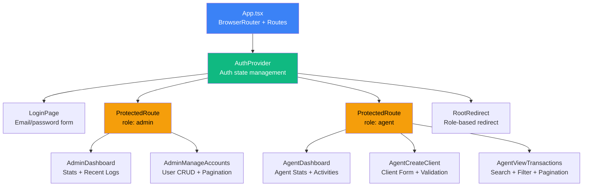
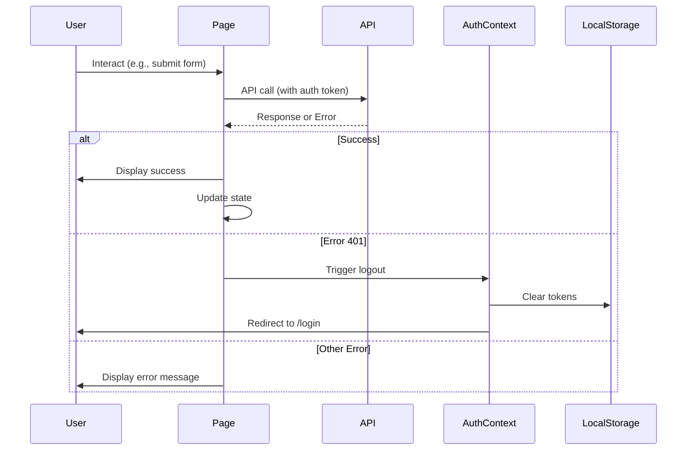

# Frontend Component Hierarchy

This document describes the component structure of the CRM UI frontend.

## Component Tree

```
App (BrowserRouter + AuthProvider)
│
├── Routes
│   ├── /login → LoginPage (public)
│   │
│   ├── ProtectedRoute (role: admin)
│   │   ├── /admin → AdminDashboard
│   │   └── /admin/accounts → AdminManageAccounts
│   │
│   ├── ProtectedRoute (role: agent)
│   │   ├── /agent → AgentDashboard
│   │   ├── /agent/clients/new → AgentCreateClient
│   │   └── /agent/transactions → AgentViewTransactions
│   │
│   └── / → RootRedirect (redirects by role)
```

## Component Diagram



## Core Components

### App Layer

#### `App.tsx`
- **Purpose**: Root application component
- **Responsibilities**:
  - Wraps app with AuthProvider
  - Defines BrowserRouter and Routes
  - Maps routes to components
  - Implements RootRedirect logic
- **State**: None (delegates to AuthProvider)
- **Children**: All page components via routes

#### `AuthProvider` (from AuthContext.tsx)
- **Purpose**: Global authentication state management
- **Responsibilities**:
  - Manage user authentication state
  - Store/retrieve tokens from localStorage
  - Provide login/logout functions
  - Initialize auth state on mount
  - Refresh user data from API
- **State**:
  - `user: User | null` - Current user
  - `isAuthenticated: boolean` - Auth status
  - `isLoading: boolean` - Initial load state
- **Context API**: Provides `useAuth()` hook
- **Children**: Entire app

#### `ProtectedRoute.tsx`
- **Purpose**: Route guard with role-based access control
- **Responsibilities**:
  - Check authentication status
  - Verify user role matches allowed roles
  - Redirect to /login if not authenticated
  - Show 403 if wrong role
  - Show loading spinner during auth check
- **Props**:
  - `allowedRoles?: UserRole[]` - Optional role restrictions
- **Renders**: `<Outlet />` (React Router) or redirect/403

### Page Components

#### `LoginPage.tsx`
- **Purpose**: User login form
- **Features**:
  - Email + password fields
  - Client-side validation
  - Error display (field-level + banner)
  - Loading state during submission
  - Role-based redirect after success
- **Validation**:
  - Email required + format check
  - Password required + min length 6
- **State**:
  - `formData` - Email, password
  - `errors` - Field errors
  - `generalError` - API errors
  - `isLoading` - Submit state
- **Navigation**: Redirects to `/admin` or `/agent` by role

#### `AdminDashboard.tsx`
- **Purpose**: Admin overview page
- **Features**:
  - Stats cards (Total Agents, Total Clients, Recent Activities)
  - Recent activity logs table
  - Navigation to Manage Accounts
  - Logout button
- **Data Fetched**:
  - User count (via `listUsers`)
  - Client count (via `listClients`)
  - Recent logs (via `listLogs`)
- **State**:
  - `stats` - Aggregated counts
  - `recentLogs` - Log entries
  - `isLoading` - Fetch state
  - `error` - API errors
- **Auto-logout**: On 401 response

#### `AdminManageAccounts.tsx`
- **Purpose**: User account management (CRUD operations)
- **Features**:
  - Paginated user list (10 per page)
  - Create user modal (firstName, lastName, email, role, sendInvite)
  - Disable user action
  - Delete user action
  - Reset password action
  - Success/error message banners
- **Data Fetched**:
  - User list (via `listUsers`)
- **Actions**:
  - Create: `createUser`
  - Disable: `disableUser`
  - Delete: `deleteUser`
  - Reset PW: `resetUserPassword`
- **State**:
  - `users` - Current page users
  - `total` - Total count
  - `currentPage` - Pagination
  - `showCreateModal` - Modal visibility
  - `formData` - Create form
  - `formErrors` - Validation errors
  - `isSubmitting` - Submit state
- **Validation**: Required fields + email format

#### `AgentDashboard.tsx`
- **Purpose**: Agent overview page
- **Features**:
  - Stats cards (My Clients, Recent Activities)
  - Recent activity logs table (agent's own logs)
  - Navigation to Create Client, View Transactions
  - Logout button
- **Data Fetched**:
  - Client count (via `listClients`)
  - Agent's logs (via `listLogs({ agentId })`)
- **State**:
  - `clientCount` - Total clients
  - `recentActivities` - Log entries
  - `isLoading` - Fetch state
  - `error` - API errors
- **Auto-logout**: On 401 response

#### `AgentCreateClient.tsx`
- **Purpose**: Create new client profile
- **Features**:
  - Full client form (11 fields)
  - Real-time validation
  - Field-level error display
  - Success redirect to dashboard
  - Cancel button
- **Form Fields**:
  - firstName, lastName (required)
  - dateOfBirth (required, 18-100 years)
  - gender (dropdown)
  - emailAddress (required, format check)
  - phoneNumber (required, min 8 digits)
  - address, city, state, country, postalCode (all required)
- **Validation**:
  - Required field checks
  - DOB age range (18-100)
  - Email format
  - Phone format
- **State**:
  - `formData` - Client fields
  - `errors` - Field errors
  - `generalError` - API errors
  - `isSubmitting` - Submit state
- **Navigation**: Redirects to `/agent` on success
- **Error Handling**: 409 (duplicate), 422 (validation), 401 (auth)

#### `AgentViewTransactions.tsx`
- **Purpose**: View and filter transactions
- **Features**:
  - Paginated transaction list (20 per page)
  - Search by client ID or transaction ID
  - Filter by status (Completed, Pending, Failed)
  - Filter by type (Deposit, Withdrawal)
  - Filter by date range (from/to)
  - Reset filters button
  - Amount formatting (currency)
  - Status badges (color-coded)
- **Data Fetched**:
  - Transaction list (via `listTransactions`)
- **State**:
  - `transactions` - Current page data
  - `total` - Total count
  - `currentPage` - Pagination
  - `filters` - Search + filter criteria
  - `isLoading` - Fetch state
  - `error` - API errors
- **Pagination**: Prev/Next buttons, page indicator
- **Auto-logout**: On 401 response

## Shared Patterns

### Navigation Pattern
All pages include:
- Top nav bar with page title
- Breadcrumb navigation (where applicable)
- Logout button (except LoginPage)

### Loading Pattern
All data-fetching pages show:
- Centered spinner during initial load
- Disabled buttons during submission

### Error Pattern
All pages handle errors:
- Red banner for general/API errors
- Field-level errors for forms
- Auto-logout on 401

### Styling Pattern
All pages use:
- Dark theme (slate-900 background)
- Boxed card layouts
- TailwindCSS utility classes
- Consistent spacing (px-6 py-4 for cards)
- Consistent button styles

## Data Flow



## Testing Strategy

### Unit Tests
- AuthContext: login, logout, token storage
- ProtectedRoute: auth checks, role checks, redirects
- AgentCreateClient: validation, submit, error handling
- AgentViewTransactions: renders, empty state, error state

### E2E Tests
- Admin flow: login → dashboard → manage accounts (5s load)
- Agent flow: login → create client → view transactions (5s load)

## Future Enhancements

Potential improvements:
- Shared UI component library (Button, Input, Card, etc.)
- Toast notification system (replace banner messages)
- Dark/light theme toggle
- Client search/filter on agent dashboard
- Transaction export (CSV, PDF)
- User profile edit page
- Password change flow
- Refresh token rotation
