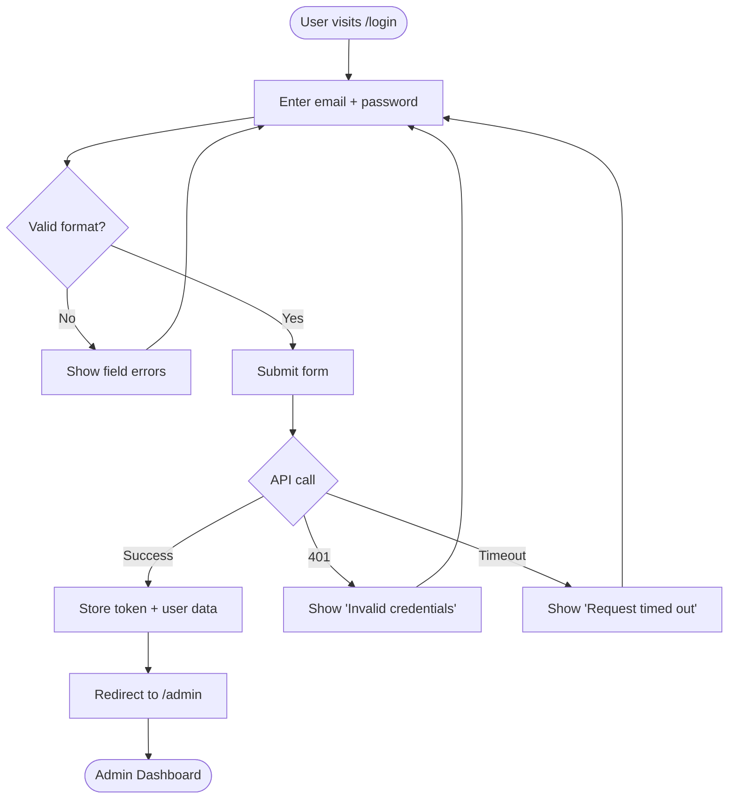
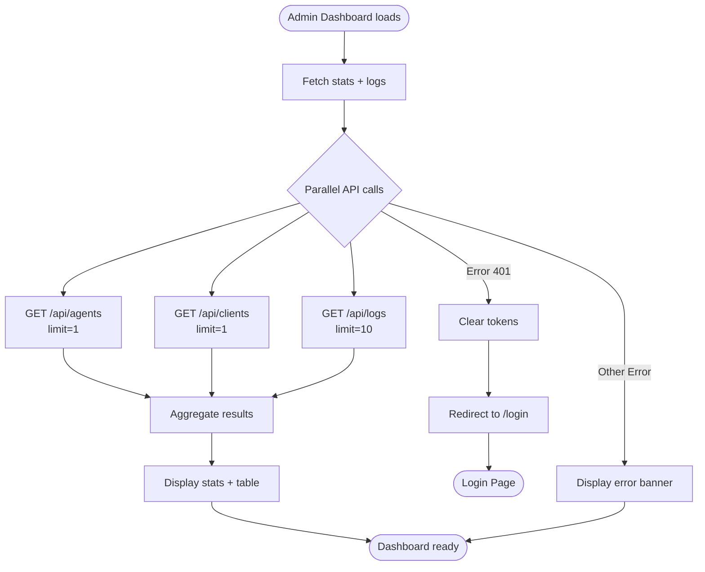
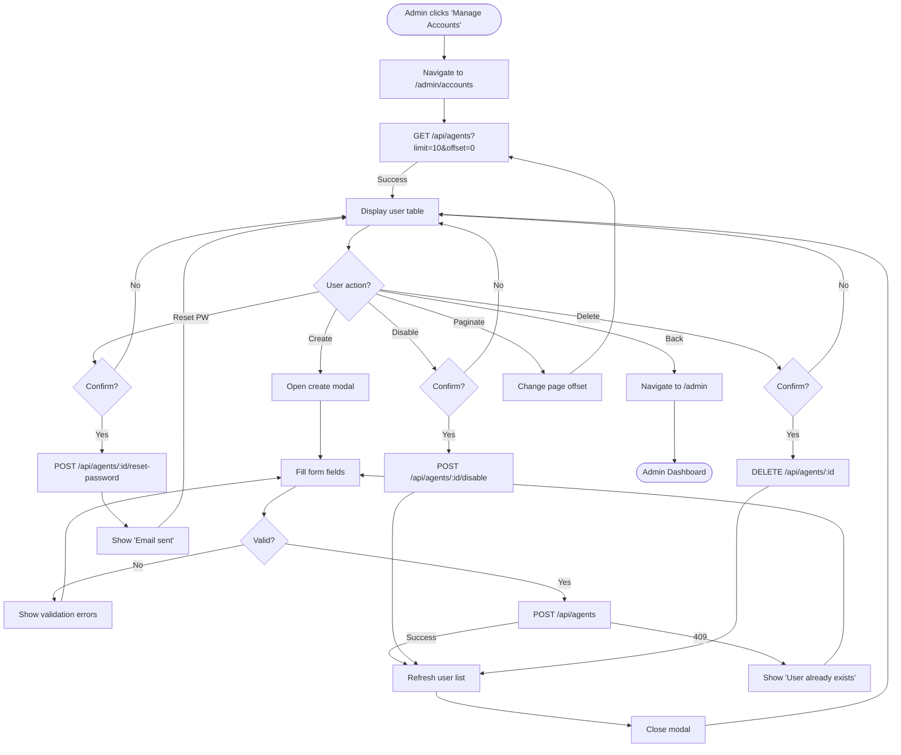
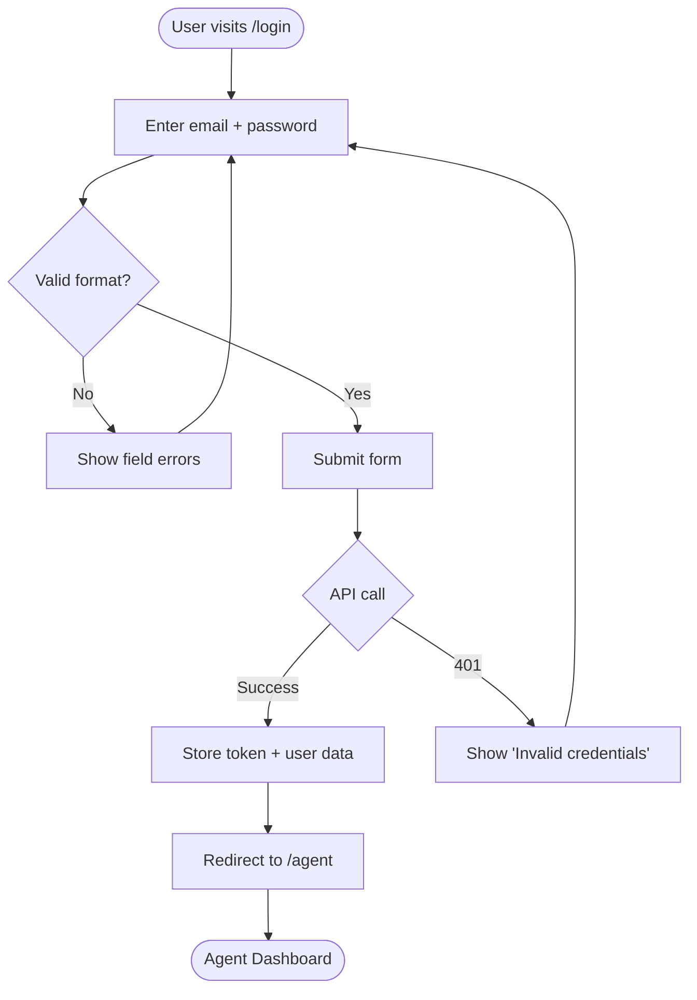
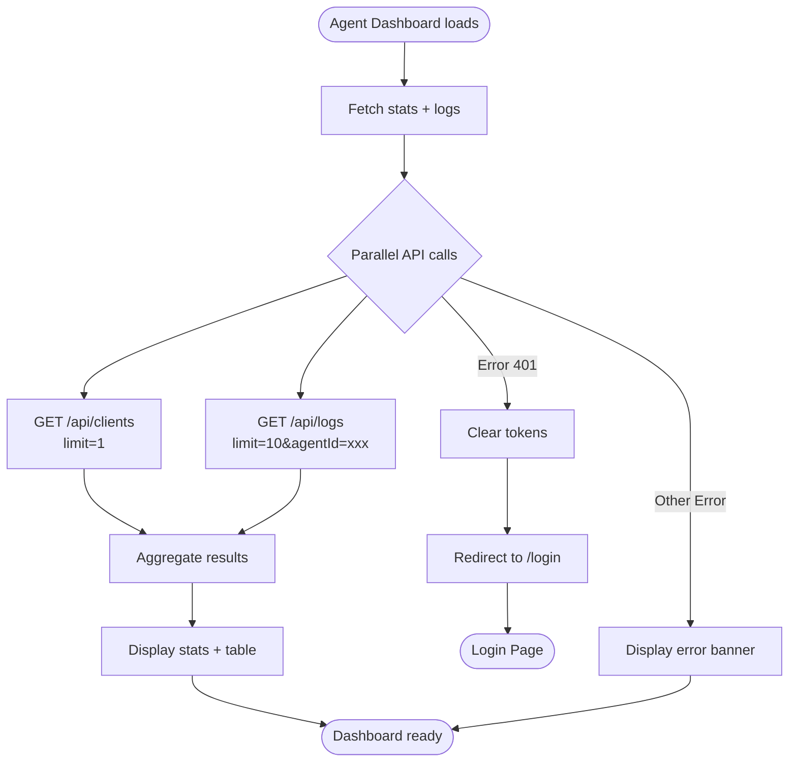
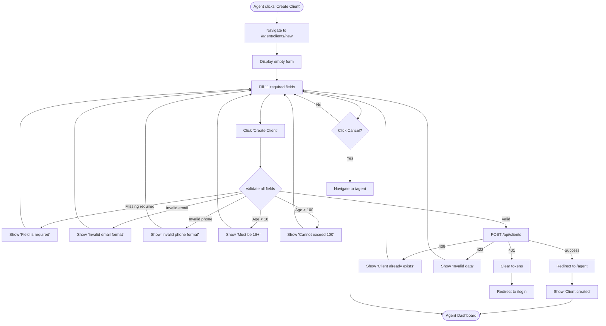
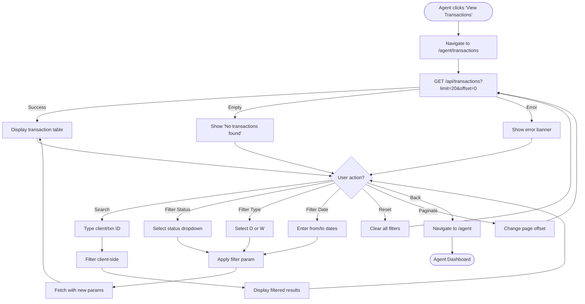
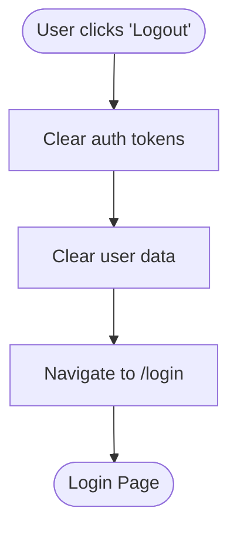
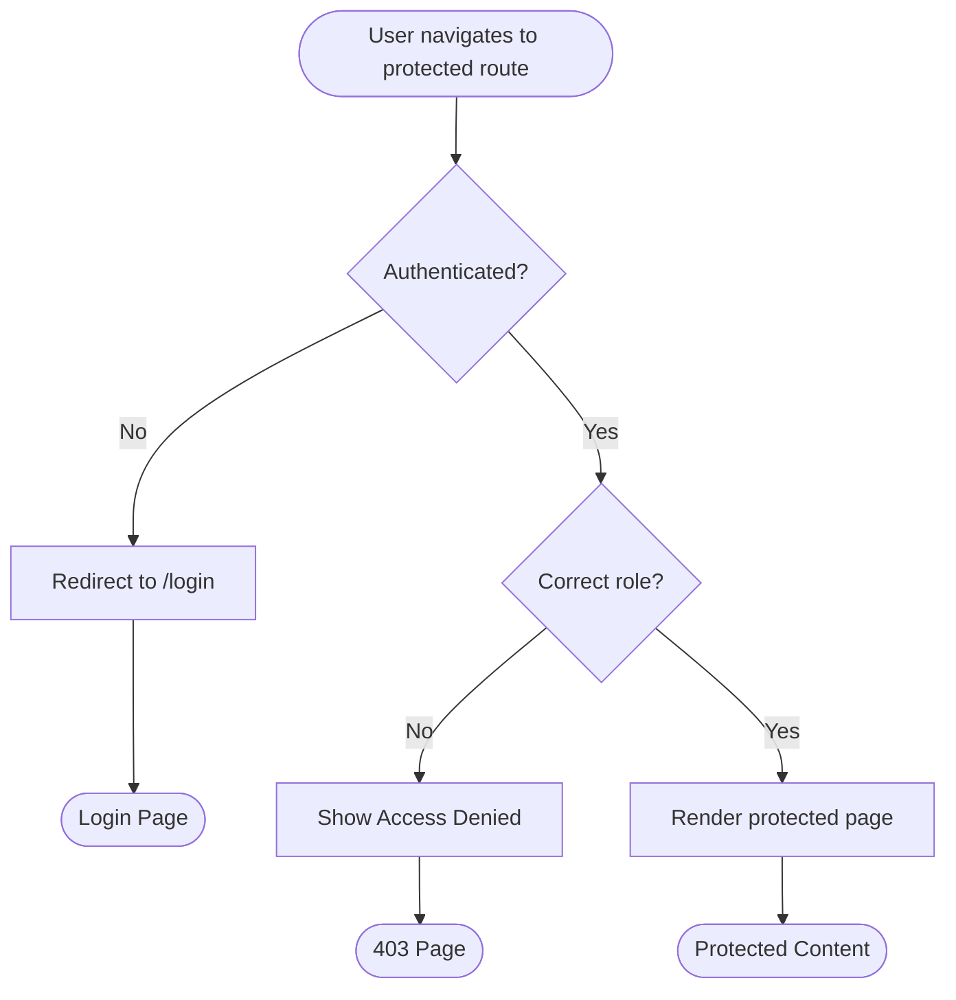
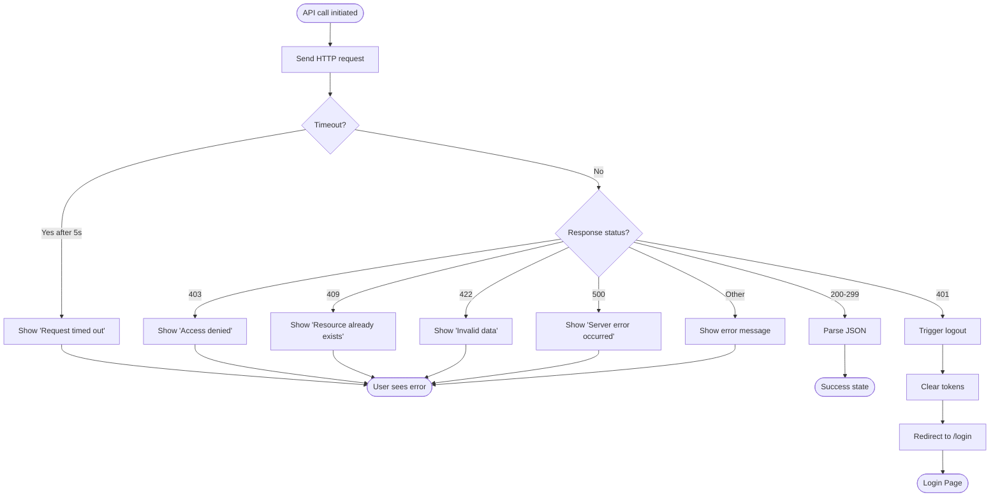

# User Flows

This document describes the key user journeys in the CRM UI frontend.

## Admin User Flows

### 1. Admin Login Flow

### 2. Admin View Dashboard Flow

### 3. Admin Manage Accounts Flow

## Agent User Flows

### 4. Agent Login Flow

### 5. Agent View Dashboard Flow

### 6. Agent Create Client Flow

### 7. Agent View Transactions Flow

## Common Flows

### 8. Logout Flow

### 9. Protected Route Access Flow

### 10. API Error Handling Flow

## User Journey Summary

### Admin Journey

1. Login with admin credentials
2. View dashboard (stats + recent logs)
3. Navigate to Manage Accounts
4. Create new agent user
5. View user list with pagination
6. Disable/delete users as needed
7. Reset user passwords
8. Logout

**Key Actions:**
- User CRUD operations
- View all system activity
- Manage agent accounts

**Performance Target:** Page loads <= 5s

### Agent Journey

1. Login with agent credentials
2. View dashboard (client count + own activity)
3. Navigate to Create Client
4. Fill out comprehensive client form
5. Submit with validation (18-100 years, email, phone)
6. Return to dashboard
7. Navigate to View Transactions
8. Filter by status, type, date range
9. Search by client ID
10. Logout

**Key Actions:**
- Create client profiles
- View transactions (own clients only)
- Filter and search transactions

**Performance Target:** Page loads <= 5s

## Error Scenarios

### Network Errors
- Request timeout (5s) → Show retry message
- Network failure → Show connection error
- Server down → Show service unavailable

### Authentication Errors
- Invalid credentials → Show error, stay on login
- Session expired → Auto-logout, redirect to login
- Token missing → Redirect to login

### Authorization Errors
- Wrong role → Show 403 Access Denied
- Resource not owned → Show 403 error

### Validation Errors
- Client-side validation → Show field-level errors
- Server-side validation (422) → Show general error
- Duplicate resource (409) → Show conflict message

### Data Errors
- Empty results → Show "No data found" state
- Pagination overflow → Clamp to valid page
- Invalid filter params → Clear filters, show all

## Accessibility Considerations

- All forms have labels
- Error messages associated with fields
- Loading states clearly indicated
- Keyboard navigation supported
- Focus management on modals

## Performance Optimizations

- Parallel API calls for dashboard stats
- Pagination to limit data transfer
- Client-side search filter (no API roundtrip)
- Image assets cached (1 year)
- HTML not cached (SPA)
- Request timeout enforced (5s max)
